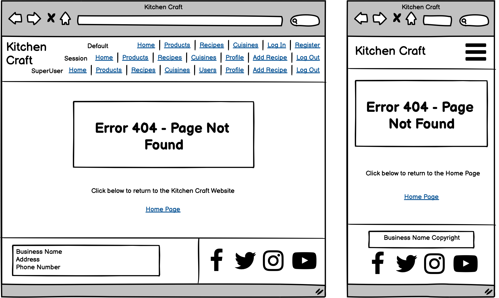
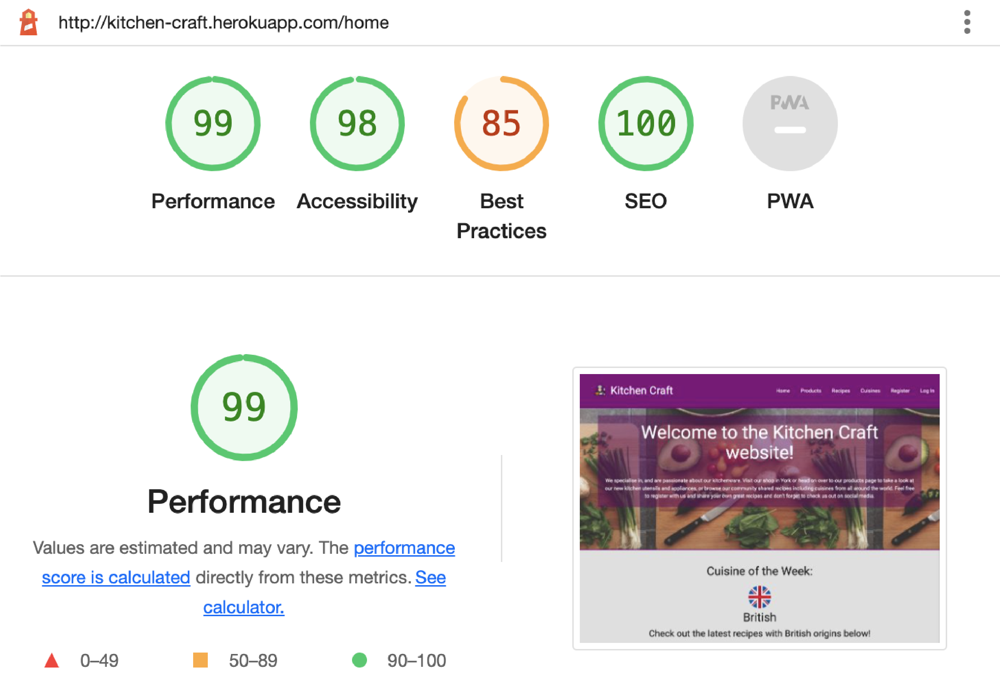

<h1 align="center">Data-Centric-Backend-Development-Milestone-Project (Milestone Project #3)</h1>
<h1 align="center">Olly Lomax</h1>

<h2 align="center"></h2>

# Kitchen Craft Website
I built this website using my knowledge of HTML5, CSS3, JavaScript, jQuery, Materialize, Python, MongoDB and Flask which I have learned from Code Institute during my Diploma in Full Stack Software Development. Kitchen Craft is an imaginary brand that I have created to showcase my knowledge and skills in the aforementioned languages and frameworks with the intention of completing my Data Centric Backend Development Milestone Project.

View the live project [here](https://kitchen-craft.herokuapp.com/).

## UX STRATEGY

### Goals
  - To expand upon my knowledge of HTML5, CSS3, JavaScript and jQuery.
  - To show my knowledge of Python, Flask, MongoDB and Materialize frameworks.
  - To provide a responsive website fulfilling the UX Design philosophy.
  - To provide a website showcasing kitchen products for sale
  - To provide a website with user registration and profile page
  - To provide a website with community driven recipe sharing
  - To provide a website with admin functionality for adding new cuisines
  - To provide a website with superuser functionality for managing admin permissions and bans

### User Stories

    - As a user, I want to easily understand the purpose of the site.

    - As a user, I want to clearly view the website and content on any device.

    - As a user, I want to easily navigate the website so that I can find content quickly.

    - As a user, I want to be able to see what kitchen products are for sale and how much they are.

    - As a user, I want to be able to see all the community shared recipes

    - As a user, I want to be able to search the community shared recipes

    - As a user, I want to be able to see information about the different cuisines of the world

    - As a user, I want to be able to register to the website so that I can share my own recipes

    - As a user, I want to be able to easily return to the website if I encounter a page error

    - As a registered user, I want to be able to log in to my account on the website

    - As a registered user, I want to be able to view my profile, edit my details and change my password

    - As a registered user, I want to be able to add, edit and delete my own recipes

    - As a registered user, I want to be able to see all my recipes on my profile page

    - As an admin user, I want to be able to add, edit and delete cuisines

    - As the superuser, I want to be able to view and search the users page

    - As the superuser, I want to be able to edit admins and bans for users

    - As the superuser, I want to be able to delete users

## UX SCOPE

- ### Planned Features

    - Creating and storing Recipe, Product, Cuisine and User information as collections inside a mongoDB database.
    - Adopting UX Design Philosophy.
    - Navigation links on all pages.
    - Website title and description clearly stating intended purpose.
    - CRUD Functionality.
    - Login/Logout Functionality.
    - Home page with introduction and recipes listed under the chosen Cuisine of the Week.
    - Profile page viewable and editable by registered users, with user created recipes displayed beneath.
    - Change password page, separate from edit profile page, for users to securely change their password with validation.
    - Recipes page viewable and searchable by all users.
    - Add/Edit Recipe pages for registered users to share and edit their own recipes.
    - Products page with images, descriptions and prices viewable by all users.
    - Cuisines page with description, flag and checkbox for Cuisine of the Week viewable by all users with edit/delete buttons only viewable by admin users.
    - Add/Edit Cuisine pages for admin users to create and edit new cuisines as well as delete functionality.
    - Users page viewable and searchable only by the Superuser with editable admins, bans and delete functionality.
    - 404 and 500 error pages caught by flask error handling to direct user back to website.

    

## UX STRUCTURE

### User Story:
> As a user, I want to easily understand the purpose of the site.

- #### Acceptance Criteria:
    - Kitchen Craft logo displayed top left of navbar.
    - Heading at top of home page with an introduction explaining the website.
    - Cuisine of the Week recipes displayed immediately showing community content to user.

 - #### Implementation:
    The logo will be displayed at the top left of the navbar, this will be consistent throughout all pages. An h1 heading will welcome users and a paragraph below, clearly displayed in white text over a coloured background, will outline the exact purpose of the site. A background image behind the h1 header and paragraph will show kitchen related produce/utensils.

    A 'Cuisine of the Week' section will be created on the Home page which will be a filtered version of the mongoDB recipes collection. The Cuisine of the Week value will be the criteria to filter by. This will display a list of all recipes of that particular cuisine discernable textually and by a small country of origin flag. When this value is changed by an admin user, the recipes displayed on home page will conform to the new Cuisine of the Week.

### User Story:
> As a user, I want to clearly view the website and content on any device.

- #### Acceptance Criteria:
    - The layout of the website is well structured, clearly readable and aesthetically pleasing.
    - Across all viewports and devices.

- #### Implementation:
    Utilising rows and columns within Materialize frameworks and mobile first design will be used when coding the project and testing will be required to ensure the layout is clear on all devices. No elements should overlap their containers and all items should be responsive so that no elements are too large to display properly. Media will scale to fit all screen sizes with no stretch or distortion.

### User Story:
> As a user, I want to easily navigate the website so that I can find content quickly.

- #### Acceptance Criteria:
    - Logo will link to home page on all pages.
    - Navigation menu will be displayed on all pages.
    - All navigation links will direct to the correct pages.

 - #### Implementation:

    For an **unregistered user**, the navigation menu will consist of:

    - Home - home.html
    - Products - products.html
    - Recipes - recipes.html
    - Cuisines - cuisines.html
    - Register - register.html
    - Login - login.html

    For a **registered user**, the navigation menu will consist of:

    - Home - home.html
    - Products - products.html
    - Recipes - recipes.html
    - Cuisines - cuisines.html
    - Dropdown Menu displaying username consisting of:
        - Profile - profile.html
        - Add Recipe - add_recipe.html
        - Log Out - directs to home.html
    
    For an **admin user**, the navigation menu will consist of:
    
    - Home - home.html
    - Products - products.html
    - Recipes - recipes.html
    - Cuisines - cuisines.html
    - Dropdown Menu displaying username consisting of:
        - Profile - profile.html
        - Add Recipe - add_recipe.html
        - Add Cuisine - add_cuisine.html
        - Log Out - directs to home.html

    For the **Superuser account**, the navigation menu will consist of:
    
    - Home - home.html
    - Products - products.html
    - Recipes - recipes.html
    - Cuisines - cuisines.html
    - Users - users.html
    - Dropdown Menu displaying username consisting of:
        - Profile - profile.html
        - Add Recipe - add_recipe.html
        - Add Cuisine - add_cuisine.html
        - Log Out - directs to home.html
      
    The navigation menu will be visible on all pages. Each navigation item will direct the user to the applicable page. For smaller devices the menu will collapse into a burger menu. When clicked, this menu will expand downwards on the right hand side of the screen displaying the same navigation items. Clicking away from this menu will close it.

### User Story:
> As a user, I want to be able to see what kitchen products are for sale and how much they are.

- #### Acceptance Criteria:
    - Products page will be created.
    - Products images displayed and scaled to fit all screen sizes with no distortion.
    - Product descriptions clearly outlining product benefits
    - Product prices stand out
    - Indicate to user what the product may be useful for

 - #### Implementation:
    Product images will be selected of sufficient dots per inch to clearly show the product without loss of quality. Descriptions to be thorough enough to encourage sales and prices displayed in both a larger font size and weight. Will also display what foods the applicable item may be useful on, or what recipes they be be useful for.

### User Story:
> As a user, I want to be able to see all the community shared recipes

- #### Acceptance Criteria:
    - Recipes page will be created.
    - Community recipes will be shown on this page with relevant information
    - Dropdown boxes will extend downwards containing the lengthly information

 - #### Implementation:
    A full list of community recipes will be shown on the recipes page from the mongoDB recipes collection with the cuisine they belong to, recipe name, preparation time, cooking time, a step-by-step guide and whether the recipe is vegetarian, vegan and/or hot. They will also show which user shared the recipes and when.

### User Story:
> As a user, I want to be able to search the community shared recipes

- #### Acceptance Criteria:
    - A search bar will be displayed at the top of the Recipes page
    - A clear header will tell the user that they are able to filter recipes by their query

 - #### Implementation:
    A database index will be created on the recipes collection in MongoDB, allowing users to search by recipe name and cuisine name. When a user types in search criteria and presses the search button (or presses enter) it will return a filtered list of recipes based upon that criteria.

### User Story:
> As a user, I want to be able to see information about the different cuisines of the world

- #### Acceptance Criteria:
    - Cuisines page will be created.
    - A list of current cuisines will be displayed
    - Information about the cuisines will be included

 - #### Implementation:
    Each cuisine will include a country flag and a brief description. The cuisine chosen as the Cuisine of the Week will have a star icon at the top right, with a tooltip to let the user know.

### User Story:
> As a user, I want to be able to register to the website so that I can share my own recipes

- #### Acceptance Criteria:
    - Register page will be created.
    - A username and password will be required on form submission.
    - Additional details such as first and last name as well as email address also required.
    - Confirm password field which must match password field.

 - #### Implementation:
    The Register form will capture the username, first name, last name, password and email which when submitted, will all be stored in a MongoDB database collection called users. Each input field will have its own validation including but not limited to; minimum and maximum character limits, character requirements and regular expressions. There will also be a confirm password field as extra validation for the user's protection. Two 'silent' key/values will also be submitted for banned and admin status set to off. Upon a successful registration a session will be initialised and the user will be directed to their profile page with a flash message informing them of successful registration.

### User Story:
> As a user, I want to be able to easily return to the website if I encounter a page error

- #### Acceptance Criteria:
    - 404 page will be created.
    - 500 page will be created.
    - Both pages will provide error information and a way back to the website.

 - #### Implementation:

    Error handling will be used to catch both 404 and 500 page errors and direct the user to the respective page. This will inform them in detail of the error in question and a link will be provided directing back to the home page.

### User Story:
> As a registered user, I want to be able to log in and log out of my account on the website

- #### Acceptance Criteria:
    - Login page will be created.
    - Username will be checked against password in a secure way.

 - #### Implementation:
    Username and password will be checked against each other from the mongoDB users collection. If the password does not match, the username does not exist or the user is banned then the user will be informed of this with a flash message. When a user has successfully logged in, a session will be initialised and they will be directed to their profile page with a flash message informing them of successful login. A Log Out button will be displayed to users who are logged in. When clicked this will terminate the session, flash a message informing them of successful log out and direct them to the login page.

### User Story:
> As a registered user, I want to be able to view my profile, edit my details and change my password

- #### Acceptance Criteria:
    - Profile page will be created.
    - Edit profile page will be created.
    - Change password page will be created.
    - Buttons on the profile page will be displayed to edit profile and/or change password which will link to their respective pages and a Sign Out button.

 - #### Implementation:
    The same information that the user registered with will be displayed on the profile page, with the exception of password. The Edit Profile button will link to the respective page where the user can edit First Name, Last Name and Email Address with the same field validation as the registration page. Username changes are not permitted. The Change Password button will direct to the respective page where the user can edit their password. This will have the same validation and confirmation field as the registration page. Upon successful edits of profile or password, a flash message will let the user know it was successful. A cancel button will also be included on each form to return to the profile page. Finally, a Sign Out button will be displayed on the profile page which will terminate the session and return the user to the login page with a successful log out flash message.

### User Story:
> As a registered user, I want to be able to add, edit and delete my own recipes

- #### Acceptance Criteria:
    - Recipe link to be put on navbar dropdown for desktop.
    - Recipe link to be put on mobile navbar.
    - Add Recipe page will be created.
    - Edit Recipe page will be created.
    - Details will be required and validated on form submission
    - A Remove button shown on recipes.

 - #### Implementation:
    An Add Recipe page will be built which will be accessible by a navigation link only visible to logged in users. This will be displayed in the dropdown on the desktop navigation and a standard link in the mobile collapsible menu. The Add Recipe page itself will also be restricted to logged in users. The user will be able to create a recipe from this page by filling in all required fields with validation including but not limited to; minimum and maximum character limits, character requirements and regular expressions. The Cuisine Name field will be a select input with a list of all current cuisines available to choose from. The recipe information will be stored in a MongoDB database collection called recipes. When user has successfully created a recipe, a flash message will alert them of the successful submission and direct them to the recipes page. Submission will also commit two 'silent' key/values to the recipes collection called created_by, which will display either 'You' if you created the recipe or the username of the user if not, and upload date which will be the date of creation. These will both be displayed on each recipe.

    An Edit button will be displayed to users only on the recipes which they have themselves created. This will link to the Edit Recipe page which will have the same field validation as adding a recipe. When user has successfully edited a recipe, a flash message will alert them of the successful edit and direct them to the recipes page.

    A Remove button will be displayed to users only on the recipes which they have themselves created. This will trigger a modal dialog to either confirm the deletion of the recipe, or return to the previous page.

### User Story:
> As a registered user, I want to be able to see all my recipes on my profile page

- #### Acceptance Criteria:
    - Show all recipes created by the user on their Profile page
    - Permit all CRUD functionality as was available on the recipes page

 - #### Implementation:
    A 'Your Recipes' section will be created on the Profile page which will be a filtered version of the mongoDB recipes collection. The username will be the criteria to filter by. The same functionality on the recipes page will be available to the user on their profile page for editing and removing their recipes if desired.

### User Story:
> As an admin user, I want to be able to add, edit and delete cuisines

- #### Acceptance Criteria:
    - Buttons to be created for Add, Edit and Remove Cuisine.
    - Add Cuisine page will be created.
    - Edit Cuisine page will be created.
    - Details will be required and validated on form submission

 - #### Implementation:
    Buttons for Add, Edit and Remove Cuisine will be visible only to admin users. Their respective pages will also be restricted to admin users.

    Add Cuisine buttons will direct to Add Cuisine page where the admin user will be able to create a cuisine by filling in all required fields with validation including minimum and maximum character requirements. There will also be a base64 string input for flag images which will require a valid base64 string. On successful creation of a cuisine the admin user will be directed to the cuisines page with a successful flash message.
    If the admin user selected the Cuisine of the Week box for a new cuisine, then the current Cuisine of the Week will be unselected and replaced with the added cuisine. This will change the Cuisine of the Week recipes listed on the home page.

    The Edit Cuisine buttons will be available for all cuisines irrespective of whether the admin user themselves created them. These will link to the Edit Cuisine page where the admin user will be able to edit the cuisine with the same requirements and validation as creating a cuisine. Upon a successful edit, the admin user will be shown a flash message informing them of successful submission. If the admin user unchecked the current Cuisine of the Week, then the cuisine will not be updated and they will be directed back to the cuisines page with a flash error message informing them of why it failed. If the admin user selected the Cuisine of the Week box during the edit, then the current Cuisine of the Week will be unselected and replaced with the edited cuisine. This will change the Cuisine of the Week recipes listed on the home page.

    The Remove Cuisine buttons will be available for all cuisines irrespective of whether the admin user themselves created them. This will trigger a modal dialog to either confirm the deletion of the cuisine, or return to the cuisines page. If the admin user attempts to remove the cuisine that is the current Cuisine of the Week, then the cuisine will not be deleted and they will be directed back to the cuisines page with a flash error message informing them of why it failed.

### User Story:
> As the superuser, I want to be able to view and search the users page

- #### Acceptance Criteria:
    - Users page will be created.
    - Index will be created on Users page.
    - A search bar will be displayed at the top of the Users page.

 - #### Implementation:
    The users page will be restricted specifically to the Superuser only and will show a list of all users from the mongoDB users collection. The information displayed will be username, first name and last name. A database index will be created on the users collection in MongoDB, allowing the Superuser to search by user name, first name, last name and email address. When the Superuser types in search criteria and presses the search button (or presses enter) it will return a filtered list of users based upon that criteria.

### User Story:
> As the superuser, I want to be able to edit admins, ban and unban users as well as delete them if necessary

- #### Acceptance Criteria:
    - Admin Yes/No checkbox will be included for each user.
    - Banned Yes/No checkbox will be included for each user.
    - Remove button will be displayed for each user.

 - #### Implementation:
    Next to the username in the users list there will be an 'Is Admin?' column with a checkbox for each user. Turning the switch on and off will result in an interative update of the is_admin key/value in the mongoDB users collection which was silently submitted on user registration. This will grant or revoke the applicable admin access to the user for whom it was changed. A flash message is shown for each change made with the applicable username shown in the update message.

    Beneath each username in the users list, with the exception of the Superuser, there will be a 'Ban User?' checkbox. Turning the switch on and off will result in an interative update of the is_banned key/value in the mongoDB users collection which was silently submitted on user registration. This will prevent or allow access to the account for whom it was changed. A flash message is shown for each change made with the applicable username shown in the update message.

    Beneath each 'Ban User?' checkbox in the users list is a Remove button. This will trigger a modal dialog to either confirm the deletion of the user, or return to the users page. If the Superuser attempts to remove the Superuser account, then the user will not be deleted and they will be directed back to the users page with a flash error message informing them of why it failed. A flash message is shown for each successful user deletion.

## UX SKELETON

- ### Database Design

    MongoDB is a document-based (non-relational) datebase and the example format of the objects used in the collections I created are as follows:

    **Users Collection**

    { 
    &nbsp;&nbsp;&nbsp;&nbsp;_id: 62229395e8d2037543254f67 
    &nbsp;&nbsp;&nbsp;&nbsp;username : "olly2121" 
    &nbsp;&nbsp;&nbsp;&nbsp;fname : "olly" 
    &nbsp;&nbsp;&nbsp;&nbsp;lname : "lomax" 
    &nbsp;&nbsp;&nbsp;&nbsp;email : "lomaxolly@fakegmail.com" 
    &nbsp;&nbsp;&nbsp;&nbsp;password : "pbkdf2:sha256:260000$tmFh81PkcwabEkMX$b450de8c57705a682bba313a61c149db..." 
    &nbsp;&nbsp;&nbsp;&nbsp;is_admin : "yes" 
    &nbsp;&nbsp;&nbsp;&nbsp;is_banned : "no" 
    }

    **Recipes Collection**

    { 
    &nbsp;&nbsp;&nbsp;&nbsp;_id : 622333c07003a78209784316 
    &nbsp;&nbsp;&nbsp;&nbsp;cuisine_name : "Italian" 
    &nbsp;&nbsp;&nbsp;&nbsp;recipe_name : "Spaghetti Bolognese" 
    &nbsp;&nbsp;&nbsp;&nbsp;prep_time : "10 Minutes" 
    &nbsp;&nbsp;&nbsp;&nbsp;cook_time : "20 Minutes" 
    &nbsp;&nbsp;&nbsp;&nbsp;ingredients : "Pasta, Passata, Beef Mince, Stock, Red Wine" 
    &nbsp;&nbsp;&nbsp;&nbsp;steps : "Throw it all together" 
    &nbsp;&nbsp;&nbsp;&nbsp;created_by : "olly2121" 
    &nbsp;&nbsp;&nbsp;&nbsp;recipe_of_week : "on" 
    &nbsp;&nbsp;&nbsp;&nbsp;vegetarian : "unchecked" 
    &nbsp;&nbsp;&nbsp;&nbsp;vegan : "unchecked" 
    &nbsp;&nbsp;&nbsp;&nbsp;hot : "unchecked" 
    &nbsp;&nbsp;&nbsp;&nbsp;upload_date : "08/03/2022" 
    }

    **Products Collection**

    { 
    &nbsp;&nbsp;&nbsp;&nbsp;_id : 623ce9a7ef0464fead264ed2 
    &nbsp;&nbsp;&nbsp;&nbsp;brand : "KitchenCraft" 
    &nbsp;&nbsp;&nbsp;&nbsp;description : "Consists of a thick heavy roller made of sustainably sourced wood arou..." 
    &nbsp;&nbsp;&nbsp;&nbsp;price : "£5.99" 
    &nbsp;&nbsp;&nbsp;&nbsp;image :  base64stringjfhjakshfjkahfjkasfhak320983912123 
    &nbsp;&nbsp;&nbsp;&nbsp;name : "Rolling Pin" 
    &nbsp;&nbsp;&nbsp;&nbsp;useful_for : "pastry, chicken" 
    }

    **Cuisines Collection**

    { 
    &nbsp;&nbsp;&nbsp;&nbsp;_id : 621e1cefbb26a12d6183cd99 
    &nbsp;&nbsp;&nbsp;&nbsp;cuisine_name : "British" 
    &nbsp;&nbsp;&nbsp;&nbsp;flag : base64stringjfhjakshffdf34343jkahfjkfdassfasfhak912123 
    &nbsp;&nbsp;&nbsp;&nbsp;description : "British cuisine has distinctive national varieties in the form of Engl..." 
    &nbsp;&nbsp;&nbsp;&nbsp;cuisine_of_week.: "yes" 
    }

- ### Security

    Database connection details are set up in an [env.py](https://pypi.org/project/env.py/) file for development. 
    This is not uploaded to GitHub for security reasons. In production these are stored in Heroku. 

- ### Wireframes

    - Home (mobile & desktop)
    

    - Recipes (mobile & desktop)
    

    - Products (mobile & desktop)
    

    - Cuisines (mobile & desktop)
    

    - Register (mobile & desktop)
    

    - Log-In (mobile & desktop)
    

    - Profile (mobile & desktop)
    

    - Edit Profile (mobile & desktop)
    

    - Add Recipe (mobile & desktop)
    

    - Edit Recipe (mobile & desktop)
    

    - Add Cuisine (mobile & desktop)
    

    - Edit Cuisine (mobile & desktop)
    

    - Users (mobile & desktop)
    

    - 404 (mobile & desktop)
    

**Original Design Wireframes**
* [Home](docs/wireframes/original/home.png)
* [Recipes](docs/wireframes/original/recipes.png)
* [Tools](docs/wireframes/original/tools.png)
* [Manage Cuisines](docs/wireframes/original/manage-cuisines.png)
* [Register](docs/wireframes/original/register.png)
* [Log In](docs/wireframes/original/log-in.png)
* [Profile](readme_images/wireframes/original/profile.pdf)
* [Add Recipe](docs/wireframes/original/add-recipe.png)

## UX SURFACE

- ### Colour Scheme

    
    
    

    I used three main colours for the website. A Purple and darker purple (Indigo) for most block component elements and an off white for contrast. I felt like they complimented each other well, provided an aesthetically pleasing and user friendly theme and provided the necessary contrast to use exclusively throughout the design process.

- ### Typography
    I used the Roboto font family with weight variations for all content throughout the website which is well recognised and a standard in web design.

- ### Imagery
    I sourced the Kitchen Craft main logo and flag images from Flaticon, a free resource for vectors and icons.The home page background image was sourced from Unsplash, a free stock image website. The product images were sourced from a Shutterstock free trial which are free for personal and commercial use. Using my knowledge of Adobe Photoshop and Illustrator, all images have been selected and edited/exported with as much uniformity as possible and downsampled to decrease page load times.

- ### Notable amendments to Design

    - In contrast to my original wireframes, I decided to rename the Tools page to Products and invest the least amount of time on this page. This included the removal of the conceptual shopfront picture and introduction at the top of the page. The reasons for this were as follows:
        
        - Products is more generic terminology and would give greater room for selling anything from utensils and appliances to work surfaces and lighting.
        - When making my scope table it was abundantly clear that this page should be my least priority. Having evidenced my knowledge of HTML5 and CSS3 in previous projects it was evident that my focus should be on the other pages applying CRUD funtionality and logic in Python with use of Flask and mongoDB.
        
    - In contrast to my wireframes, I decided not to restrict the access to the Cuisines page for admins only. Instead I chose to restrict the Add, Edit and Delete buttons and accompanying routes to admin only. This resulted in the page being renamed from 'Manage Cuisines' to just Cuisines. The reason for this were as follows:

        - It seemed prudent to allow all users to be able to see all of the current cuisines listed, with their accompanying background information, their country flags and which is set as Cuisine of the Week.
    
     - In contrast to my wireframes, I decided that once a user is successfully logged in, a clickable navigation link on the top right of the page will display their username with a collapsible dropdown menu of registered user specific navigation links. This would not be implemented on the mobile site since this already encompassed a collapsible navigation menu by clicking on the burger icon. The reasons for this was as follows:

        - I considered it best practice that the navigation menu would not be too 'busy', with the inclusion of the registered user specific navigation links the navigation bar itself would contain one too many options.
        - Consolidating the registered user specific navigation links in a collapsible menu would provide greater clarity and look tidier.

    - In contrast to my wireframes, I decided not to include 'Favourite Foods' on registration. The reasons for this was as follows:

        - The information seems redundant unless it could be utilised in profile sharing with other users, which is not the concept of the website.
        - Reducing the amount of options (required or optional) on a registration page seems like best practice, and I already have First and Last name and Email address which is more than standard.

    - In contrast to my wireframes, I decided to change the display and layouts of both recipes and cuisines on their respective pages. The reasons for this were as follows:

        - Having good experience in Bootstrap frameworks, I decided to use Materialize for this website and learn as much as possible by utilising various Materialize specific components, CSS, Javascript and Form options.
        - Having a simple dropdown from the original wireframes concept would display very limited information about each specific recipe/cuisine. I want to have most of the information displayed immediately and available to the user upon loading the respective page.
        - I want the pages to be as aesthetically pleasing as possible without loss of functionality, but also look and feel different.

    - In contrast to my wireframes, I have decided to have one Edit Profile button, rather than an Edit button next to each piece of information stored. I also want to omit and separate the Password field from the Edit Profile page by building another 'Change Password' page specific to this purpose. The reasons for this are as follows:

        - It seems unnecessary for the user to have to navigate to multiple pages if they want to change more than one field, and equally unnecessary for me to build each page and route without any functionality difference between them.
        - However, the password field has multiple character requirements for validation, and is required to be repeated in the confirm password field. This will be a frustrating chore if the user simply wants to change some profile information but also has to submit a new/previous password every time.

    - In contrast to my wireframes, I have decided to add various buttons throughout the site to navigate back to the previous or corresponding page, either by 'Cancel' or 'Return' buttons on Add/Edit pages as well as modals. The reasons for this are as follows:

        - Navigation is so important for any website and a user needs to easily browse the site without any forced use of the browser buttons.
        - Repeating buttons is good practice even on the same page so long as they fall on different views of that same page.

    - In contrast to my wireframes, I have decided to build an additional 'Users' page specific to the Superuser account displaying a list of all registered users with interactive edit functionality and standard delete functionality. This page will also be indexed and contain a search element. The reasons for this are as follows:

        - Although this was not high on the Scope Table, I believe this page will challenge me the most in terms of CRUD functionality as well as security for restricting the page to the Superuser account only.
        - I wanted to try a different means of indexing, instant edits by form POSTS with listeners and securing the page to one account only. This was all done as a learning experience beyond the original scope.

## Features

- ### Current

    - Responsive across all viewports using Materialize classes.
    - Mobile responsive design.
    - Home page displaying image and clear information on the purple of the website.
    - Registration functionality.
    - Log In / Log Out functionality.
    - Navigation menu that will change based on whether user is logged in and/or has certain privileges.
    - Products page with a list of all products from the mongoDB products collection with corresponding brand, description and price.
    - Recipes page with all community recipes listed from the mongoDB recipes collection, containing Edit and Remove (Delete functionaliy) buttons for their submitted recipes only. This is an indexed page allowing users to search the recipes collection and reset the results.
    - Add Recipe page with Create functionality for registered users.
    - Edit Recipe page with Update functionality for registered users.
    - Profile page for registered users with profile info and list of their submitted recipes with Edit and Remove (Delete functionaliy) buttons.
    - Edit Profile page with Update functionality.
    - Change Password page with Update functionality.
    - Cuisines page with all cuisines listed from the mongoDB cuisines collection, containing Edit and Remove (Delete functionaliy) buttons displayed only to admin accounts.
    - Add Cuisine page with Create functionality for admin users.
    - Edit Cuisines page with Update functionality for admin users.
    - Users page viewable only to the Superuser account with all users listed from the mongoDB users collection. Each containing 'Admin' and 'Banned' checkboxes providing instant Update functionality and a Remove button providing standard Delete functionality. This is an indexed page allowing the Superuser account to search the users collection and reset the results.
    - Error handling to direct user to 404 and 500 error pages and provide a direct path back to the website.

- ### Prospective

    - Add pagination for Recipes, Products, Cuisines and Users pages for future scoping the website when additions to the respective collections are being submitted from hundreds or more users.
    - Add, Edit and Delete functionality on the Products page will be granted for admin users so that the website can expand upon the sale of kitchen related products.
    - Products will be linked to recipes via the 'useful_for' product field and the 'ingredients/steps' recipe fields. This will allow users to immediately filter all community recipes which are applicable to the use of that particular product.
    - Rather than using base64 encoding, images will be directory uploadable by admin users for both Products and Cuisines.
    - Contact Us page will be created as well as shop background information.

## Technologies Used

-   ### Languages
    - [HTML5](https://en.wikipedia.org/wiki/HTML5) 
        The language used to display content and provide structure used extensively throughout this site.
    - [CSS3](https://en.wikipedia.org/wiki/Cascading_Style_Sheets) 
        I used custom styling on top of Materalize frameworks.
    - [JavaScript](https://en.wikipedia.org/wiki/JavaScript) 
        I used custom JavaScript on top of Materialze frameworks.
    - [Python](https://www.python.org) 
        The core of this project was built using Python 3.8.11 logic and the means to run/view the website.
        Python Modules used from the requirements.txt file: 
        &nbsp;&nbsp;&nbsp;&nbsp;click==8.0.4 
        &nbsp;&nbsp;&nbsp;&nbsp;dnspython==2.2.0 
        &nbsp;&nbsp;&nbsp;&nbsp;Flask==2.0.3 
        &nbsp;&nbsp;&nbsp;&nbsp;Flask-PyMongo==2.3.0 
        &nbsp;&nbsp;&nbsp;&nbsp;itsdangerous==2.1.0 
        &nbsp;&nbsp;&nbsp;&nbsp;pymongo==4.0.1 
        &nbsp;&nbsp;&nbsp;&nbsp;Werkzeug==2.0.3 
    - [Flask](https://flask.palletsprojects.com/en/2.0.x/) 
        A lightweight Python web framework with Jinja template engine and the Werkzeug toolkit.

-   ### Frameworks, Libraries & Programs
    - [Materialize v1.0.0](https://materializecss.com/) 
        Framework used throughout the site to provide baseline styling and import JavaScript/jQuery.
    - [MongoDB](https://www.mongodb.com/) 
        MongoDB is a non-relational, document-based database program which was used to create my collections and as data storage for this project.
    - [Heroku](https://www.mongodb.com/) 
        Used to deploy the live version of the website.
    - [Google Fonts](https://fonts.google.com/) 
        Used to import the Roboto font used throughout the website.
    - [Font Awesome](https://fontawesome.com/) 
        Used for various icons including the Vegetarian, Vegan and Hot icons shown on recipes.
    - [jQuery](https://jquery.com/) 
        jQuery is used for the following: 
        &nbsp;&nbsp;&nbsp;&nbsp;Collapsible navigation link on desktop header. 
        &nbsp;&nbsp;&nbsp;&nbsp;Getting the current year being injected into the copyright footer. 
        &nbsp;&nbsp;&nbsp;&nbsp;Materialize mobile sidenav. 
        &nbsp;&nbsp;&nbsp;&nbsp;Materialize tooltips. 
        &nbsp;&nbsp;&nbsp;&nbsp;Materialize select input. 
        &nbsp;&nbsp;&nbsp;&nbsp;Materialize textarea character counters. 
        &nbsp;&nbsp;&nbsp;&nbsp;Materialize modal dialogs. 
    - [Git](https://git-scm.com/) 
        Used for version control to commit and push code via Gitpod to the GitHub repository where the source code is stored.
    - [Gitpod](https://www.gitpod.io/) 
        This is the IDE (Integrated Development Environment) I used to build the website and commit to Git and push to GitHub
    - [GitHub](https://github.com/) 
        GitHub is used to store the projects code after being pushed from Git and to host the deployment of the live site via GitHub Pages.
    - [Adobe Photohop](https://www.adobe.com/uk/products/photoshop.html) 
        Used to convert and resize images before uploading to local repositry.
    - [Adobe Illustrator](https://www.adobe.com/uk/products/illustrator.html) 
        Used to edit logo and export documents before uploading to local repositry.
    - [Balsamiq](https://balsamiq.com/) 
        Used during the scoping process to visualise the basic structure of the website and create wireframes during the Skeleton phase of UX Design.

-   ### Resources, Tools & Diagnostics
    - [Unsplash](https://unsplash.com/) 
        Free stock image database used for the home page image.
    - [Shutterstock](https://www.shutterstock.com) 
        Paid stock photo database which I used for all product images. These images are licenced under the free trial of 10 image downloads.
    - [Flaticon](https://www.flaticon.com/) 
        Free stock resource for vectors and icons, used for Kitchen Craft logo and for country flag icons.
    - [Elmah base64 Image Encoder](https://elmah.io/tools/base64-image-encoder/) 
        Used to encode both country flag and product images into base64 strings which can be used on form submission.
    - [TinyJPG](https://tinyjpg.com) 
        Used to downsample images to smaller file sizes in order to increase load times and reduce storage requirements.
    - [Favicon.io](https://favicon.io/) 
        Used in the creation of the website Favicon across all pages.
    - [Chrome DevTools](https://developer.chrome.com/docs/devtools/) 
        Used throughout the design process for debugging purposes in console.
    - [Safari Web Inspector](https://developer.apple.com/safari/tools/) 
        Used as above for cross-browser support.
    - [Firefox Developer Tools](https://developer.mozilla.org/en-US/docs/Tools) 
        Used as above for cross-browser support.
    - [Am I Responsive?](http://ami.responsivedesign.is/) 
        Used to create a website mock-up image across different sized devices to showcase viewport responsiveness.
    - [WAVE](https://wave.webaim.org/) 
        Used for diagnostic contrast testing.
    - [Lighthouse](https://developers.google.com/web/tools/lighthouse) 
        Used for diagnostic performance, accessibility and SEO testing.
    - [W3C Markup Validation Service](https://validator.w3.org/) 
        HTML Validator used to validate every page of the project to ensure there were no syntax errors.
    - [W3C CSS Validation Service](https://jigsaw.w3.org/css-validator/) 
        CSS Validator used to ensure there were no syntax errors in styling.
    - [JSHint](https://jshint.com/) 
        JavaScript related tool to check for errors and potential problems in my JavaScript code
    - [PEP8Online](http://pep8online.com/) 
        Python related tool to check for PEP8 compliance.

## Testing

- The W3C Markup Validator Service was used to validate every page in the project to ensure there were no syntax errors or warnings.
    - Home
        
    - Products
        
    - Recipes
        
    - Cuisines
        
    - Register
        
    - Login
        
    - Pages requiring a a login session or admin/superuser status returned no errors or warnings. They were tested by the following approach:
        - Copy full HTML in developer tools from the desired page.
        - Go to the [W3C Markup Validator Page](https://validator.w3.org/nu/).
        - Click on the 'Check by' dropdown option.
        - Select 'text input'.
        - Paste HTML into the text area provided.
- The W3C CSS Validator was used to validate my project css files to ensure there were no errors or warnings.    
    - This returned 7 warnings which all came from frameworks or external libraries.
        - One errors in the materialize.min.css file.
        - Six errors in the font-awesome/6.0.0/css/all.min.css file.
    
- To make sure that my own style.css file is error free, I used the following approach:
    - Copy my css code from my style.css file.
    - Go to [W3C CSS Validation Page](https://jigsaw.w3.org/css-validator/).
    - Click on the 'By direct input' tab at the top of the window.
    - Paste my css code into the supplied text area.
    - Click on 'Check'
    
    

- WAVE, a Web Accessibility Evaluation Tool was used for contrast testing.
 

- Lighthouse was used for performance, accessibility and SEO testing. 
    - Each page returned a score of **85-100** for each page.
    
    - The reason for the score of 85 on each page was due to the site not using a secure HTTPS connection. This is due to not having uploaded an SSL certificate to Heroku.
    

- JSHint, a JavaScript Static Code Analysis Tool was used to check both script.js and pwvalidator.js for the coherence and quality of my code, making sure it is error free and that no potential problems exist. Both files were clear of any errors or warnings.
    - script.js
    
    - pwvalidator.js
    

- PEP8 online is a tool to check the conformity of my code to the PEP8 python coding convention.
    - The check reported one error stating a module level import is not at the top of my app.py file. This is referring to the protected env.py file which is only being loaded if a path exists.
    

- I ran the website locally and tested on the deployed version. No differences found.

## Test Strategy
 - The testing will be 

    This will be done on four web browsers:-
    - Chrome
    - Firefox
    - Safari
    - Edge

    And on every common breakpoint (Mobile, Tablet, Desktop, XL Desktop).

 - Validation of feature inclusion will be undertaken from the wireframes scoped during the Skeleton stage of UX design.
 
 - Elements should not overlap other container divs and should remain on the screen at all sizes above and including 300px.

The live project is deployed [here](https://kitchen-craft.herokuapp.com/).

## Deployment

### Project Creation
I created this project by first installing the Gitpod [plugin](https://www.gitpod.io/). I then navigated to the Code Institute [gitpod-full-template](https://github.com/Code-Institute-Org/gitpod-full-template) and clicked on the "Use this Template" button. I chose and input my project name (Kitchen-Craft---Backend-Development-Milestone-Project) then created my repositry from the template by clicking the button. After that I simply clicked on the "Gitpod" button from my repositry page to open up my IDE and begin coding.

The following commands were used throughout the development process:

- **git status** 
 Used to show my untracked and staged files.
- **git add** 
 Used to add files to the staging area before commiting.
- **git commit -m** 
 Used to commit the changes to my local repository.
- **git push** 
 Used to push all commited changes to the GitHub repository.
- **git log** 
 Used to show a list of my previous commits.
- **git reset --hard** 
 Used with applicable checksum to revert to a previous commit.

### Deployment to Heroku

- Create application:

    - Navigate to the [Heroku website](https://id.heroku.com/) and login.
    - Click on the 'New' button
    - Browse down to 'Create New App' link and click.
    - Enter the desired name of the app, in this case I called it the same as on Github.
    - Select the region, in this case 'Europe'.

- Connect to Github Repository:

    - Click the 'Deploy' tab at the top of dashboard.
    - Select 'GitHub' then 'Connect to GitHub'.
    - A prompt to find your github repository will then be displayed.
    - Enter your repository name in the search field and press enter.
    - Once you have found the desired repo, click the 'Connect' button.

- Set the environment variables:

    - Click the 'Settings' tab at the top of the dashboard.
    - Click the 'Reveal Config Vars' button.
    - Add the following: 

        **IP** : 0.0.0.0 
        **PORT** : 5000 
        **MONGO_DBNAME** : *This is the database name you want to connect to* 
        **MONGO_URI** : *This can be found in MongoDB by going to clusters > connect > connect to your application and substituting the password and dbname that you set up in the link* 
        **SECRET_KEY** : *This is a custom secret key set up for configuration to keep client-side sessions secure*

- Enable automatic deployment:

    - Click the 'Deploy'' tab at the top of the dashboard.
    - Scroll down to the automatic deploys section.
    - Choose the branch you want to deploy from.
    - Click on 'Enable Automatic Deploys'.

- Website deployed [here](https://kitchen-craft.herokuapp.com/)

### Run Locally

This project will not run locally with database connections unless the [env.py](https://pypi.org/project/env.py/) file is set up configuring the IP, PORT, MONGO_URI, MONGO_DBNAME and SECRET_KEY. These details are required but due to both security and privacy they are not disclosed in this repositry.

- Navigate to my [Github Repository](https://github.com/ollylomax/Kitchen-Craft---Backend-Development-Milestone-Project).
- Click the 'Code' button for a drop down menu.
- Download and unpack the ZIP file then and open with the IDE you prefer.
#### OR
- Navigate to my [GitHub Repository](https://github.com/ollylomax/Kitchen-Craft---Backend-Development-Milestone-Project).
- Click the 'Code' button for a drop down menu.- Copy Git URL from the HTTPS dialogue box.
- Open the IDE you prefer then open a terminal window in a directory of your choice.
- Use the **git clone** command in the terminal followed by the copied git URL.
- A clone of the project will be created locally on your machine.

- Once this is done run the following command in the shell to install all the required packages:
> pip install -r requirements.txt

### Fork Project 

Forks are used to either propose changes to other projects or to use as a starting point to build upon your own development ideas.

- Navigate to my [GitHub Repository](https://github.com/ollylomax/Kitchen-Craft---Backend-Development-Milestone-Project).
- Click on the 'Fork' button at the very top right of the page.
- This will create an identical duplicate of the project in your own repositry.

## Credits
 - ### Code

    Materialize 1.0.0 was used throughout the project to assist in making site responsive using the Materialize grid system, components, forms, javascript and css.

    jQuery library was used in my script files to make document traversal and manipulation easier as well as to make code less verbose. Most of the jQuery code was imported from Materialize framework requirements.

    I used the [Code Institute Materialize Select Validator](https://github.com/Code-Institute-Solutions/TaskManagerAuth/tree/main/04-AddingATask-WritingToTheDatabase/02-materialize-select-validation) from the task manager walkthrough lessons for my recipe forms.

    I referenced the following links to research base64 encoding. In particular how to convert an image to a base64 string in Python, display an image from base64 code in HTML and to source a regular expression that would fit my intended purpose. 

    [Link 1](https://stackoverflow.com/questions/8571501/how-to-check-whether-a-string-is-base64-encoded-or-not) 
    [Link 2](https://www.codespeedy.com/convert-image-to-base64-string-in-python/) 
    [Link 3](https://www.codespeedy.com/display-an-image-from-base64-code-in-html/) 
    [Link 4](https://stackoverflow.com/questions/3715493/encoding-an-image-file-with-base64)

   I referenced this [stackoverflow link](https://stackoverflow.com/questions/19868016/check-that-field-exists-with-mongodb) to research how I would check to see if a particular key exists in one of my mongoDB collections.

   I referenced this [stackoverflow link](https://stackoverflow.com/questions/28968660/how-to-convert-a-pymongo-cursor-cursor-into-a-dict) to refresh my memory on how to convert mongoDB cursor objects into Python dictionaries.

   I referenced this [w3schools link](https://www.w3schools.com/jsref/event_onload.asp) to refresh my memory on event listening within HTML and Javascript.

   I referenced this [stackoverflow link](https://stackoverflow.com/questions/21310147/catch-all-path-in-flask-app) to research 'catch-all' route paths which I ended up not using as I opted for error handling instead.

   I referenced this [Tutorials point link](https://www.tutorialspoint.com/How-to-sort-a-Python-date-string-list)
   to learn how to sort and format a Python date string.

   

 - ### Content
   All content on this site was created by Olly Lomax.

 - ### Media

   All images on this site were sourced from free stock images on [Shutterstock](https://www.shutterstock.com) free trial, [Flaticon](https://www.flaticon.com/) and [Unsplash](https://unsplash.com/).

 - ### Acknowledgements

    Many thanks to my Code Institute Mentor Daisy McGirr for her insight and advice during development.