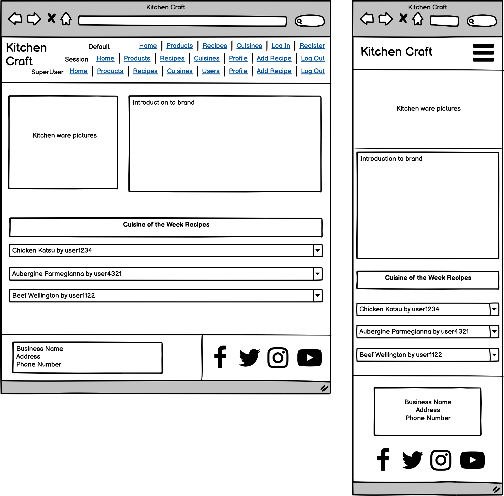
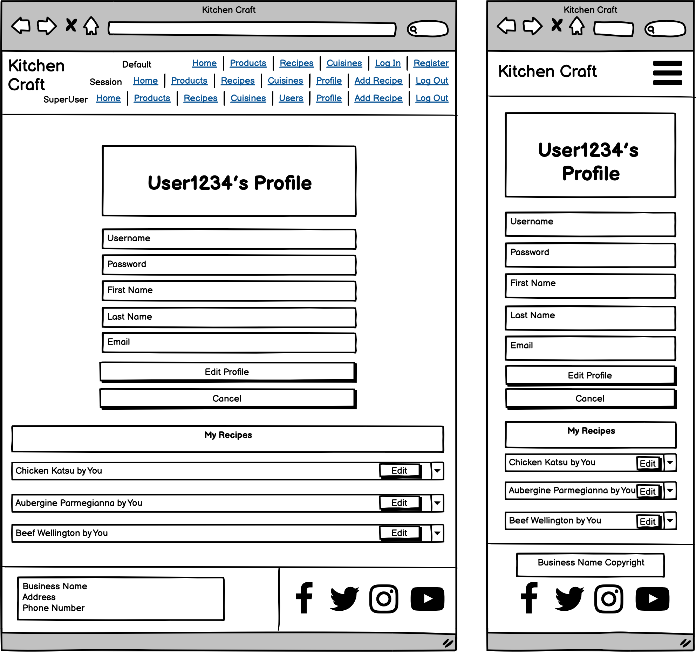
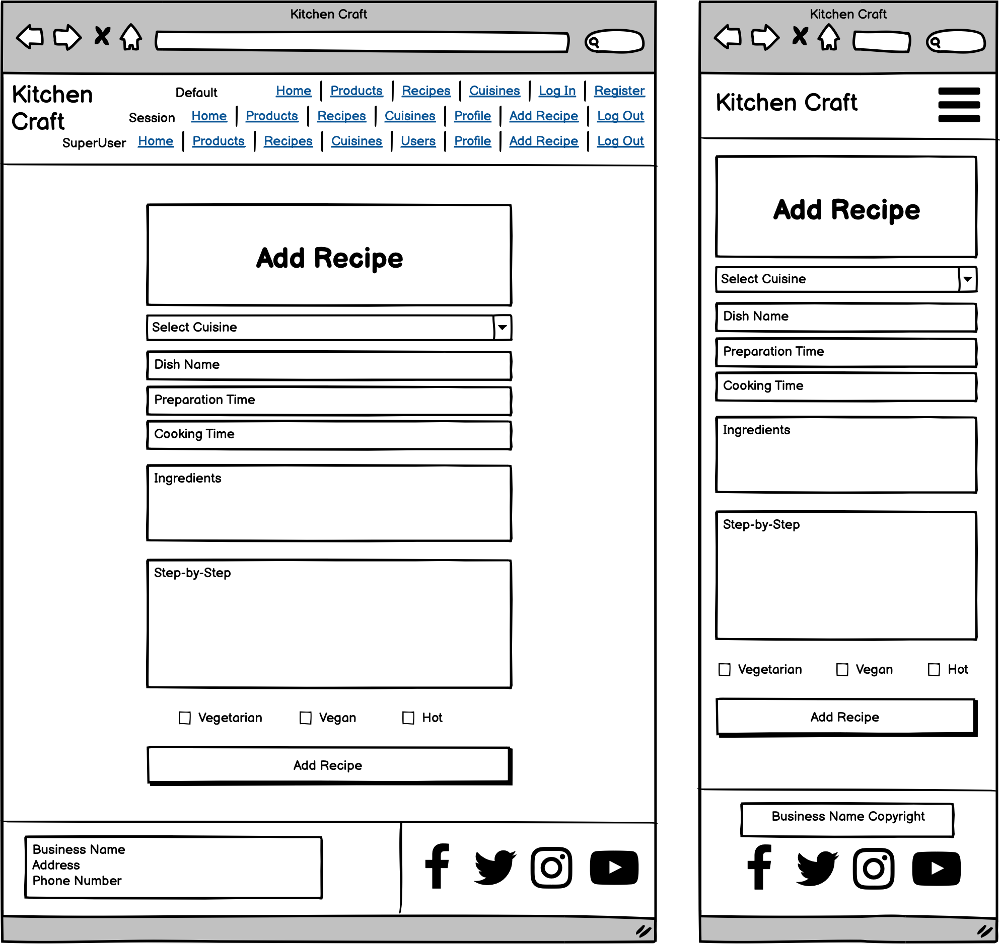

<h1 align="center">Data-Centric-Backend-Development-Milestone-Project (Milestone Project #3)</h1>
<h1 align="center">Olly Lomax</h1>

<h2 align="center"></h2>

# Kitchen Craft Website
I built this website using my knowledge of HTML5, CSS3, JavaScript, jQuery, Materialize, Python, MongoDB and Flask which I have learned from Code Institute during my Diploma in Full Stack Software Development. Kitchen Craft is an imaginary brand that I have created to showcase my knowledge and skills in the aforementioned languages and frameworks with the intention of completing my Data Centric Backend Development Milestone Project.

View the live project [here](https://kitchen-craft.herokuapp.com/).

## UX STRATEGY

### Goals
  - To expand upon my knowledge of HTML5, CSS3, JavaScript and jQuery.
  - To show my knowledge of Python, Flask, MongoDB and Materialize frameworks.
  - To provide a responsive website fulfilling the UX Design philosophy.
  - To provide a website showcasing kitchen products for sale
  - To provide a website with user registration and profile page
  - To provide a website with community driven recipe sharing
  - To provide a website with admin functionality for adding new cuisines
  - To provide a website with superuser functionality for managing admin permissions and bans

### User Stories

    - As a user, I want to easily understand the purpose of the site.

    - As a user, I want to clearly view the website and content on any device.

    - As a user, I want to easily navigate the website so that I can find content quickly.

    - As a user, I want to be able to see what kitchen products are for sale and how much they are.

    - As a user, I want to be able to see all the community shared recipes

    - As a user, I want to be able to search the community shared recipes

    - As a user, I want to be able to see information about the different cuisines of the world

    - As a user, I want to be able to register to the website so that I can share my own recipes

    - As a user, I want to be able to easily return to the website if I encounter a page error

    - As a registered user, I want to be able to log in to my account on the website

    - As a registered user, I want to be able to view my profile, edit my details and change my password

    - As a registered user, I want to be able to add, edit and delete my own recipes

    - As a registered user, I want to be able to see all my recipes on my profile page

    - As a registered user, I want to be able to log out of the website

    - As an admin user, I want to be able to add, edit and delete cuisines

    - As an admin user, I want to be able to change the Cuisine of the Week

    - As the superuser, I want to be able to view and search the users page

    - As the superuser, I want to be able to edit admins and bans for users

    - As the superuser, I want to be able to delete users

## UX SCOPE

- ### Planned Features

    - Creating and storing Recipe, Product, Cuisine and User information as collections inside a mongoDB database.
    - Adopting UX Design Philosophy.
    - Navigation links on all pages.
    - Website title and description clearly stating intended purpose.
    - CRUD Functionality.
    - Login/Logout Functionality.
    - Home page with introduction and recipes listed under the chosen Cuisine of the Week.
    - Profile page viewable and editable by registered users, with user created recipes displayed beneath.
    - Change password page, separate from edit profile page, for users to securely change their password with validation.
    - Recipes page viewable and searchable by all users.
    - Add/Edit Recipe pages for registered users to share and edit their own recipes.
    - Products page with images, descriptions and prices viewable by all users.
    - Cuisines page with description, flag and checkbox for Cuisine of the Week viewable by all users with edit/delete buttons only viewable by admin users.
    - Add/Edit Cuisine pages for admin users to create and edit new cuisines as well as delete functionality.
    - Users page viewable and searchable only by the Superuser with editable admins, bans and delete functionality.
    - 404 and 500 error pages caught by flask error handling to direct user back to website.

    

## UX STRUCTURE

### User Story:
> As a user, I want to easily understand the purpose of the site.

- #### Acceptance Criteria:
    - Kitchen Craft logo displayed top left of navbar.
    - Heading at top of home page with an introduction explaining the website.

 - #### Implementation:
    The logo will be displayed at the top left of the navbar, this will be consistent throughout all pages. An h1 heading will welcome users and a paragraph below, clearly displayed in white text over a coloured background, will outline the exact purpose of the site. A background image behind the h1 header and paragraph will show kitchen related produce/utensils.

### User Story:
> As a user, I want to clearly view the website and content on any device.

- #### Acceptance Criteria:
    The layout of the website is well structured, clearly readable and aesthetically pleasing across all viewports and devices.

- #### Implementation:
    Utilising rows and columns within Materialize frameworks and mobile first design will be used when coding the project and testing will be required to ensure the layout is clear on all devices. No elements should overlap their containers and all items should be responsive so that no elements are too large to display properly. Media will scale to fit all screen sizes with no stretch or distortion.

### User Story:
> As a user, I want to easily navigate the website so that I can find content quickly.

- #### Acceptance Criteria:
    Logo will link to home page on all pages.
    Navigation menu will be displayed on all pages.
    All navigation links will direct to the correct pages.

 - #### Implementation:

    For an **unregistered user**, the navigation menu will consist of:

    Home - home.html
    Products - products.html
    Recipes - recipes.html
    Cuisines - cuisines.html
    Register - register.html
    Login - login.html

    For an **registered user**, the navigation menu will consist of:

    - Home - home.html
    - Products - products.html
    - Recipes - recipes.html
    - Cuisines - cuisines.html
    - Dropdown Menu displaying username consisting of:
        - Profile - profile.html
        - Add Recipe - add_recipe.html
        - Log Out - directs to home.html
    
    For an **admin user**, the navigation menu will consist of:
    
    - Home - home.html
    - Products - products.html
    - Recipes - recipes.html
    - Cuisines - cuisines.html
    - Dropdown Menu displaying username consisting of:
        - Profile - profile.html
        - Add Recipe - add_recipe.html
        - Add Cuisine - add_cuisine.html
        - Log Out - directs to home.html

    For the **Superuser account**, the navigation menu will consist of:
    
    - Home - home.html
    - Products - products.html
    - Recipes - recipes.html
    - Cuisines - cuisines.html
    - Users - users.html
    - Dropdown Menu displaying username consisting of:
        - Profile - profile.html
        - Add Recipe - add_recipe.html
        - Add Cuisine - add_cuisine.html
        - Log Out - directs to home.html
      
    The navigation menu will be visible on all pages. Each navigation item will direct the user to the applicable page. For smaller devices the menu will collapse into a burger menu. When clicked, this menu will expand downwards on the right hand side of the screen displaying the same navigation items. Clicking away from this menu will close it.

### User Story:
> As a user, I want to be able to see what kitchen products are for sale and how much they are.

- #### Acceptance Criteria:
    Products images displayed and scaled to fit all screen sizes with no distortion.
    Product descriptions clearly outlining product benefits
    Product prices stand out
    Indicate to user what the product may be useful for

 - #### Implementation:
    Product images will be selected of sufficient dots per inch to clearly show the product without loss of quality. Descriptions to be thorough enough to encourage sales and prices displayed in both a larger font size and weight. Will also display what foods the applicable item may be useful on, or what recipes they be be useful for.

### User Story:
> As a user, I want to be able to see all the community shared recipes

- #### Acceptance Criteria:
    User will be shown a picture of the turtle, his/her name and betting odds in order for them to be comfortable with their choice.

 - #### Description:
    Turtle portraits and names will be randomly assigned to each name and be clearly displayed alongside their respective odds to win the race.

### User Story:
> As a user, I want to be able to easily bet on my chosen turtle.

- #### Acceptance Criteria:
    User able to distinguish between betting boxes relevant to the turtle they wish to bet on and input the tokens they desire.

 - #### Description:
    Input fields will be provided and clearly displayed beneath the portrait, name and odds of the relevant turtle.

### User Story:
> As a user, I want to be warned if I forgot to input a bid before starting the race.

- #### Acceptance Criteria:
    User will be alerted if they try to start a race without making a bet on a turtle

 - #### Description:
    An alert dialog will pop on screen if the start race button is clicked or if the keyboard Enter key is pressed while in a bet field without a bet entered.

### User Story:
> As a user, I want to be able to see how many tokens I have remaining.

- #### Acceptance Criteria:
    User will be shown the total amount of tokens they have at all stages throughout the game.

 - #### Description:
    A box containing an interactive display of user tokens is displayed underneath the game window in bold.

### User Story:
> As a user, I want to be able to quickly and easily start the race.

- #### Acceptance Criteria:
    User can initiate the race to begin.

 - #### Description:

    ’Start Race’ button will be provided underneath the game window and the keyboard Enter key will also initiate the race if a bet has been entered into bet field.

### User Story:
> As a user, I want to be able to clearly see where the turtles have finished in each race.

- #### Acceptance Criteria:
    User can see on the race track where each turtle finished in the race.

 - #### Description:
    In each lane the turtle icons are displayed in their designated position in which they finished the race, from 1st to 4th.

### User Story:
> As a user, I want to see my tokens update after each race.

- #### Acceptance Criteria:
    User’s attention will be directed towards their tokens value when a race is complete.

 - #### Description:
    User tokens value will shake with a css effect and briefly change colour corresponding to gaining (green) or losing (red) tokens after a race has finished.

### User Story:
> As a user, I want to be able to see if I win my bet, and how many tokens I won. 
> As a user, I want to be able to see if I lose my bet, and how many tokens I lost.

- #### Acceptance Criteria:
    User will be clearly informed of race outcome, including winning turtle, whether their turtle won as well as exact token gains and losses.

 - #### Description:
    A results box is provided for the user which displays:

    - The winning turtle.
    - Whether the chosen turtle to bet on has won or not.
    - If their turtle won, the amount of tokens gained is shown.
    - If their turtle didn’t win, the amount of tokens lost is shown.

### User Story:
> As a user, I want to be able to visually see how many tokens I need to win the game.

- #### Acceptance Criteria:
    User will be shown current progression towards winning the game both informatively and visually.

 - #### Description:
    Textual values are shown beneath the game window of current tokens compared to the 1000 tokens required to win the game.

    An interactive progression bar is also shown in the same position, giving the user a visual representation of progress towards a winning outcome.

### User Story:
> As a user, I want to be able to quickly and easily move on to the next race.

- #### Acceptance Criteria:
    User can move onto the next race and decide on their next bet.

 - #### Description:
    A ’Next Race’ button replaces the ‘Start Race’ button after it is clicked underneath the game window.

### User Story:
> As a user, I want to be alerted when I win or lose the game.

- #### Acceptance Criteria:
    User will be alerted upon winnings and losing scenarios.

 - #### Description:
    Modal popups are initiated when winning or losing scenarios have been met, informing the user of the outcome.

### User Story:
> As a user, I want to be able to quickly start a new game.

- #### Acceptance Criteria:
    After a game as been won or lost, user will easily be able to restart the game to play again.

 - #### Description:
    Restart button provided on modal dialogs which restarts the game completely. Closing the modals using the ‘x’ at the top right has the same effect.

## UX SKELETON

- ### Wireframes

    - Home (mobile & desktop)
    

    - Recipes (mobile & desktop)
    

    - Products (mobile & desktop)
    

    - Cuisines (mobile & desktop)
    

    - Register (mobile & desktop)
    

    - Log-In (mobile & desktop)
    

    - Profile (mobile & desktop)
    

    - Edit Profile (mobile & desktop)
    

    - Add Recipe (mobile & desktop)
    

    - Edit Recipe (mobile & desktop)
    

    - Add Cuisine (mobile & desktop)
    

    - Edit Cuisine (mobile & desktop)
    

    - Users (mobile & desktop)
    

    - 404 (mobile & desktop)
    

